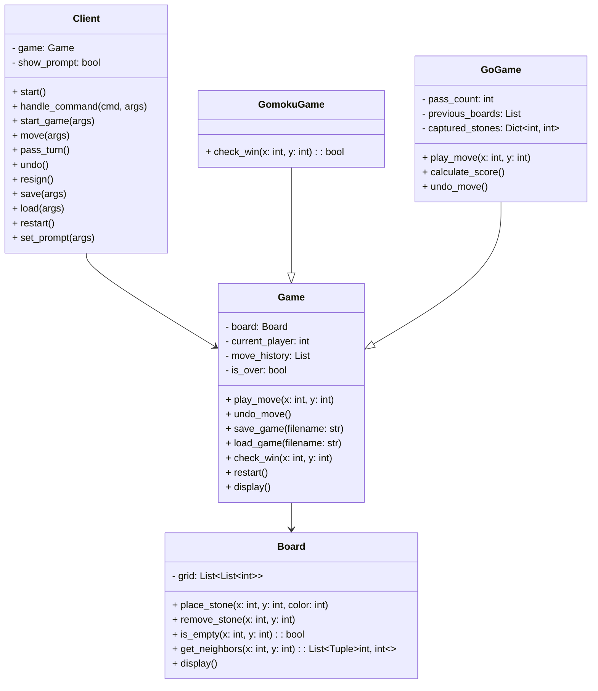

## 设计文档

### 设计思路与设计模式选用

#### 设计思路

1. **模块化设计**：
   - 将用户交互逻辑（Client 类）与游戏逻辑（Game 类及其子类）分离。
   - 游戏逻辑只负责管理棋盘状态、落子规则和胜负判断，用户交互逻辑负责解析用户输入并调用游戏逻辑。
2. **面向对象的封装**：
   - 游戏棋盘（`Board` 类）独立于游戏逻辑，用于表示棋盘状态，便于五子棋和围棋共享。
   - 通过继承机制实现不同游戏的逻辑（`GomokuGame` 和 `GoGame`），复用基础逻辑。
3. **可扩展性**：
   - 新增游戏类型只需继承 `Game` 类并实现特定逻辑。
   - `Client` 类可以以相同的方式处理不同的游戏类型。

#### **设计模式**

1. **策略模式**：
   
   不同的游戏类型（如五子棋和围棋）封装在不同的类中，通过多态机制动态决定如何处理落子和胜负判断。
   
2. **单一职责原则**：
   
   将棋盘操作、游戏规则和用户交互分别封装在 `Board`、`Game` 及其子类、`Client` 中，各司其职。
   
3. **开闭原则**：
   
   `Game` 类及其子类提供统一的接口，便于扩展新的游戏逻辑而无需修改原有代码。
   
4. **依赖倒置原则**：
   
   `Client` 类不依赖具体的游戏实现，而依赖于 `Game` 类提供的抽象接口。

### **关键类与函数说明**

#### **Board 类**

- 功能：表示棋盘状态，提供棋盘操作的基础方法。
- 主要函数：
  - `place_stone(x, y, color)`：在棋盘 (x, y) 处放置指定颜色的棋子。
  - `remove_stone(x, y)`：移除棋盘 (x, y) 处的棋子。
  - `get_neighbors(x, y)`：获取 (x, y) 位置的邻居坐标。
  - `display()`：在控制台打印当前棋盘状态。

#### **Game 类**

- 功能：定义游戏逻辑的通用接口，管理棋盘、玩家顺序和游戏状态。
- 主要函数：
  - `play_move(x, y)`：执行玩家落子，管理胜负判断和状态更新。
  - `undo_move()`：悔棋一步。
  - `save_game(filename)` 和 `load_game(filename)`：保存和加载游戏状态。
  - `restart()`：重新开始游戏。

#### **GomokuGame 类**

- 功能：继承 `Game` 类，提供五子棋的胜负判断逻辑。
- 主要函数：
  - `check_win(x, y)`：检查在 (x, y) 位置是否形成五连珠。

#### **GoGame 类**

- 功能：继承 `Game` 类，实现围棋的规则与胜负判定。
- 主要函数：
  - `play_move(x, y)`：处理落子和合法性检查（如自杀、劫争）。
  - `_remove_dead_stones(board, x, y, color)`：移除棋盘上无气的棋子。
  - `calculate_score()`：计算双方得分并判定胜负。

#### **Client 类**

- 功能：负责用户输入的解析和与游戏逻辑的交互。
- 主要函数：
  - `start()`：启动客户端，进入指令输入循环。
  - `handle_command(cmd, args)`：解析用户输入并调用对应方法。
  - `start_game(args)`、`move(args)`、`undo()` 等：对应用户输入指令的操作。

### **UML 类图**




### 测试输入与输出结果

```
欢迎来到五子棋和围棋游戏！

可用指令：
1. start <game_type> <board_size> - 开始游戏，game_type为gomoku或go，board_size为8-19的整数
2. move <x> <y> - 在(x, y)位置落子
   pass - 不落子（仅围棋）
3. undo - 悔棋一步
4. resign - 投子认负
5. save <filename> - 保存当前局面
6. load <filename> - 读取局面
7. restart - 重新开始游戏
8. prompt - 显示指令提示
9. exit - 退出游戏

请输入指令：start gomoku
指令格式错误

请输入指令：start gomoku 8
游戏开始！棋盘大小为8x8
当前玩家: 黑棋
   0  1  2  3  4  5  6  7
 0 ·  ·  ·  ·  ·  ·  ·  ·
 1 ·  ·  ·  ·  ·  ·  ·  ·
 2 ·  ·  ·  ·  ·  ·  ·  ·
 3 ·  ·  ·  ·  ·  ·  ·  ·
 4 ·  ·  ·  ·  ·  ·  ·  ·
 5 ·  ·  ·  ·  ·  ·  ·  ·
 6 ·  ·  ·  ·  ·  ·  ·  ·
 7 ·  ·  ·  ·  ·  ·  ·  ·

请输入指令：pass
五子棋不支持PASS

请输入指令：move 1 1
当前玩家: 白棋
   0  1  2  3  4  5  6  7
 0 ·  ·  ·  ·  ·  ·  ·  ·
 1 ·  ○  ·  ·  ·  ·  ·  ·
 2 ·  ·  ·  ·  ·  ·  ·  ·
 3 ·  ·  ·  ·  ·  ·  ·  ·
 4 ·  ·  ·  ·  ·  ·  ·  ·
 5 ·  ·  ·  ·  ·  ·  ·  ·
 6 ·  ·  ·  ·  ·  ·  ·  ·
 7 ·  ·  ·  ·  ·  ·  ·  ·

请输入指令：move 1 1
发生错误：该位置已有棋子

请输入指令：move 2 1
当前玩家: 黑棋
   0  1  2  3  4  5  6  7
 0 ·  ·  ·  ·  ·  ·  ·  ·
 1 ·  ○  ●  ·  ·  ·  ·  ·
 2 ·  ·  ·  ·  ·  ·  ·  ·
 3 ·  ·  ·  ·  ·  ·  ·  ·
 4 ·  ·  ·  ·  ·  ·  ·  ·
 5 ·  ·  ·  ·  ·  ·  ·  ·
 6 ·  ·  ·  ·  ·  ·  ·  ·
 7 ·  ·  ·  ·  ·  ·  ·  ·

请输入指令：move 2 2
当前玩家: 白棋
   0  1  2  3  4  5  6  7
 0 ·  ·  ·  ·  ·  ·  ·  ·
 1 ·  ○  ●  ·  ·  ·  ·  ·
 2 ·  ·  ○  ·  ·  ·  ·  ·
 3 ·  ·  ·  ·  ·  ·  ·  ·
 4 ·  ·  ·  ·  ·  ·  ·  ·
 5 ·  ·  ·  ·  ·  ·  ·  ·
 6 ·  ·  ·  ·  ·  ·  ·  ·
 7 ·  ·  ·  ·  ·  ·  ·  ·

请输入指令：move 1 4
当前玩家: 黑棋
   0  1  2  3  4  5  6  7
 0 ·  ·  ·  ·  ·  ·  ·  ·
 1 ·  ○  ●  ·  ·  ·  ·  ·
 2 ·  ·  ○  ·  ·  ·  ·  ·
 3 ·  ·  ·  ·  ·  ·  ·  ·
 4 ·  ●  ·  ·  ·  ·  ·  ·
 5 ·  ·  ·  ·  ·  ·  ·  ·
 6 ·  ·  ·  ·  ·  ·  ·  ·
 7 ·  ·  ·  ·  ·  ·  ·  ·

请输入指令：move 3 3
当前玩家: 白棋
   0  1  2  3  4  5  6  7
 0 ·  ·  ·  ·  ·  ·  ·  ·
 1 ·  ○  ●  ·  ·  ·  ·  ·
 2 ·  ·  ○  ·  ·  ·  ·  ·
 3 ·  ·  ·  ○  ·  ·  ·  ·
 4 ·  ●  ·  ·  ·  ·  ·  ·
 5 ·  ·  ·  ·  ·  ·  ·  ·
 6 ·  ·  ·  ·  ·  ·  ·  ·
 7 ·  ·  ·  ·  ·  ·  ·  ·

请输入指令：move 7 1
当前玩家: 黑棋
   0  1  2  3  4  5  6  7
 0 ·  ·  ·  ·  ·  ·  ·  ·
 1 ·  ○  ●  ·  ·  ·  ·  ●
 2 ·  ·  ○  ·  ·  ·  ·  ·
 3 ·  ·  ·  ○  ·  ·  ·  ·
 4 ·  ●  ·  ·  ·  ·  ·  ·
 5 ·  ·  ·  ·  ·  ·  ·  ·
 6 ·  ·  ·  ·  ·  ·  ·  ·
 7 ·  ·  ·  ·  ·  ·  ·  ·

请输入指令：move 4 4
当前玩家: 白棋
   0  1  2  3  4  5  6  7
 0 ·  ·  ·  ·  ·  ·  ·  ·
 1 ·  ○  ●  ·  ·  ·  ·  ●
 2 ·  ·  ○  ·  ·  ·  ·  ·
 3 ·  ·  ·  ○  ·  ·  ·  ·
 4 ·  ●  ·  ·  ○  ·  ·  ·
 5 ·  ·  ·  ·  ·  ·  ·  ·
 6 ·  ·  ·  ·  ·  ·  ·  ·
 7 ·  ·  ·  ·  ·  ·  ·  ·

请输入指令：move 5 5
当前玩家: 黑棋
   0  1  2  3  4  5  6  7
 0 ·  ·  ·  ·  ·  ·  ·  ·
 1 ·  ○  ●  ·  ·  ·  ·  ●
 2 ·  ·  ○  ·  ·  ·  ·  ·
 3 ·  ·  ·  ○  ·  ·  ·  ·
 4 ·  ●  ·  ·  ○  ·  ·  ·
 5 ·  ·  ·  ·  ·  ●  ·  ·
 6 ·  ·  ·  ·  ·  ·  ·  ·
 7 ·  ·  ·  ·  ·  ·  ·  ·

请输入指令：move 0 0
玩家 黑棋 胜利！
当前玩家: 黑棋
   0  1  2  3  4  5  6  7
 0 ○  ·  ·  ·  ·  ·  ·  ·
 1 ·  ○  ●  ·  ·  ·  ·  ●
 2 ·  ·  ○  ·  ·  ·  ·  ·
 3 ·  ·  ·  ○  ·  ·  ·  ·
 4 ·  ●  ·  ·  ○  ·  ·  ·
 5 ·  ·  ·  ·  ·  ●  ·  ·
 6 ·  ·  ·  ·  ·  ·  ·  ·
 7 ·  ·  ·  ·  ·  ·  ·  ·

请输入指令：move 6 6
游戏未开始或已结束

请输入指令：start gomoku 8
游戏开始！棋盘大小为8x8
当前玩家: 黑棋
   0  1  2  3  4  5  6  7
 0 ·  ·  ·  ·  ·  ·  ·  ·
 1 ·  ·  ·  ·  ·  ·  ·  ·
 2 ·  ·  ·  ·  ·  ·  ·  ·
 3 ·  ·  ·  ·  ·  ·  ·  ·
 4 ·  ·  ·  ·  ·  ·  ·  ·
 5 ·  ·  ·  ·  ·  ·  ·  ·
 6 ·  ·  ·  ·  ·  ·  ·  ·
 7 ·  ·  ·  ·  ·  ·  ·  ·

请输入指令：prompt

可用指令：
1. start <game_type> <board_size> - 开始游戏，game_type为gomoku或go，board_size为8-19的整数
2. move <x> <y> - 在(x, y)位置落子
   pass - 不落子（仅围棋）
3. undo - 悔棋一步
4. resign - 投子认负
5. save <filename> - 保存当前局面
6. load <filename> - 读取局面
7. restart - 重新开始游戏
8. prompt - 显示指令提示
9. exit - 退出游戏

请输入指令：move 0 0
当前玩家: 白棋
   0  1  2  3  4  5  6  7
 0 ○  ·  ·  ·  ·  ·  ·  ·
 1 ·  ·  ·  ·  ·  ·  ·  ·
 2 ·  ·  ·  ·  ·  ·  ·  ·
 3 ·  ·  ·  ·  ·  ·  ·  ·
 4 ·  ·  ·  ·  ·  ·  ·  ·
 5 ·  ·  ·  ·  ·  ·  ·  ·
 6 ·  ·  ·  ·  ·  ·  ·  ·
 7 ·  ·  ·  ·  ·  ·  ·  ·

请输入指令：undo
当前玩家: 黑棋
   0  1  2  3  4  5  6  7
 0 ·  ·  ·  ·  ·  ·  ·  ·
 1 ·  ·  ·  ·  ·  ·  ·  ·
 2 ·  ·  ·  ·  ·  ·  ·  ·
 3 ·  ·  ·  ·  ·  ·  ·  ·
 4 ·  ·  ·  ·  ·  ·  ·  ·
 5 ·  ·  ·  ·  ·  ·  ·  ·
 6 ·  ·  ·  ·  ·  ·  ·  ·
 7 ·  ·  ·  ·  ·  ·  ·  ·

请输入指令：move 6 6
当前玩家: 白棋
   0  1  2  3  4  5  6  7
 0 ·  ·  ·  ·  ·  ·  ·  ·
 1 ·  ·  ·  ·  ·  ·  ·  ·
 2 ·  ·  ·  ·  ·  ·  ·  ·
 3 ·  ·  ·  ·  ·  ·  ·  ·
 4 ·  ·  ·  ·  ·  ·  ·  ·
 5 ·  ·  ·  ·  ·  ·  ·  ·
 6 ·  ·  ·  ·  ·  ·  ○  ·
 7 ·  ·  ·  ·  ·  ·  ·  ·

请输入指令：move 5 5
当前玩家: 黑棋
   0  1  2  3  4  5  6  7
 0 ·  ·  ·  ·  ·  ·  ·  ·
 1 ·  ·  ·  ·  ·  ·  ·  ·
 2 ·  ·  ·  ·  ·  ·  ·  ·
 3 ·  ·  ·  ·  ·  ·  ·  ·
 4 ·  ·  ·  ·  ·  ·  ·  ·
 5 ·  ·  ·  ·  ·  ●  ·  ·
 6 ·  ·  ·  ·  ·  ·  ○  ·
 7 ·  ·  ·  ·  ·  ·  ·  ·

请输入指令：save 111
游戏已保存至 111

请输入指令：load 111
已从 111 加载游戏
当前玩家: 黑棋
   0  1  2  3  4  5  6  7
 0 ·  ·  ·  ·  ·  ·  ·  ·
 1 ·  ·  ·  ·  ·  ·  ·  ·
 2 ·  ·  ·  ·  ·  ·  ·  ·
 3 ·  ·  ·  ·  ·  ·  ·  ·
 4 ·  ·  ·  ·  ·  ·  ·  ·
 5 ·  ·  ·  ·  ·  ●  ·  ·
 6 ·  ·  ·  ·  ·  ·  ○  ·
 7 ·  ·  ·  ·  ·  ·  ·  ·

请输入指令：prompt

可用指令：
1. start <game_type> <board_size> - 开始游戏，game_type为gomoku或go，board_size为8-19的整数
2. move <x> <y> - 在(x, y)位置落子
   pass - 不落子（仅围棋）
3. undo - 悔棋一步
4. resign - 投子认负
5. save <filename> - 保存当前局面
6. load <filename> - 读取局面
7. restart - 重新开始游戏
8. prompt - 显示指令提示
9. exit - 退出游戏

请输入指令：restart
游戏已重新开始
当前玩家: 黑棋
   0  1  2  3  4  5  6  7
 0 ·  ·  ·  ·  ·  ·  ·  ·
 1 ·  ·  ·  ·  ·  ·  ·  ·
 2 ·  ·  ·  ·  ·  ·  ·  ·
 3 ·  ·  ·  ·  ·  ·  ·  ·
 4 ·  ·  ·  ·  ·  ·  ·  ·
 5 ·  ·  ·  ·  ·  ·  ·  ·
 6 ·  ·  ·  ·  ·  ·  ·  ·
 7 ·  ·  ·  ·  ·  ·  ·  ·

请输入指令：move 1 1
当前玩家: 白棋
   0  1  2  3  4  5  6  7
 0 ·  ·  ·  ·  ·  ·  ·  ·
 1 ·  ○  ·  ·  ·  ·  ·  ·
 2 ·  ·  ·  ·  ·  ·  ·  ·
 3 ·  ·  ·  ·  ·  ·  ·  ·
 4 ·  ·  ·  ·  ·  ·  ·  ·
 5 ·  ·  ·  ·  ·  ·  ·  ·
 6 ·  ·  ·  ·  ·  ·  ·  ·
 7 ·  ·  ·  ·  ·  ·  ·  ·

请输入指令：resign
玩家 白棋 认负！

请输入指令：move 1 2
游戏未开始或已结束

请输入指令：prompt

可用指令：
1. start <game_type> <board_size> - 开始游戏，game_type为gomoku或go，board_size为8-19的整数
2. move <x> <y> - 在(x, y)位置落子
   pass - 不落子（仅围棋）
3. undo - 悔棋一步
4. resign - 投子认负
5. save <filename> - 保存当前局面
6. load <filename> - 读取局面
7. restart - 重新开始游戏
8. prompt - 显示指令提示
9. exit - 退出游戏

请输入指令：start go 9
游戏开始！棋盘大小为9x9
当前玩家: 黑棋
黑棋提子数：0，白棋提子数：0
   0  1  2  3  4  5  6  7  8
 0 ·  ·  ·  ·  ·  ·  ·  ·  ·
 1 ·  ·  ·  ·  ·  ·  ·  ·  ·
 2 ·  ·  ·  ·  ·  ·  ·  ·  ·
 3 ·  ·  ·  ·  ·  ·  ·  ·  ·
 4 ·  ·  ·  ·  ·  ·  ·  ·  ·
 5 ·  ·  ·  ·  ·  ·  ·  ·  ·
 6 ·  ·  ·  ·  ·  ·  ·  ·  ·
 7 ·  ·  ·  ·  ·  ·  ·  ·  ·
 8 ·  ·  ·  ·  ·  ·  ·  ·  ·

请输入指令：move 1 1
当前玩家: 白棋
黑棋提子数：0，白棋提子数：0
   0  1  2  3  4  5  6  7  8
 0 ·  ·  ·  ·  ·  ·  ·  ·  ·
 1 ·  ○  ·  ·  ·  ·  ·  ·  ·
 2 ·  ·  ·  ·  ·  ·  ·  ·  ·
 3 ·  ·  ·  ·  ·  ·  ·  ·  ·
 4 ·  ·  ·  ·  ·  ·  ·  ·  ·
 5 ·  ·  ·  ·  ·  ·  ·  ·  ·
 6 ·  ·  ·  ·  ·  ·  ·  ·  ·
 7 ·  ·  ·  ·  ·  ·  ·  ·  ·
 8 ·  ·  ·  ·  ·  ·  ·  ·  ·

请输入指令：move 2 2
当前玩家: 黑棋
黑棋提子数：0，白棋提子数：0
   0  1  2  3  4  5  6  7  8
 0 ·  ·  ·  ·  ·  ·  ·  ·  ·
 1 ·  ○  ·  ·  ·  ·  ·  ·  ·
 2 ·  ·  ●  ·  ·  ·  ·  ·  ·
 3 ·  ·  ·  ·  ·  ·  ·  ·  ·
 4 ·  ·  ·  ·  ·  ·  ·  ·  ·
 5 ·  ·  ·  ·  ·  ·  ·  ·  ·
 6 ·  ·  ·  ·  ·  ·  ·  ·  ·
 7 ·  ·  ·  ·  ·  ·  ·  ·  ·
 8 ·  ·  ·  ·  ·  ·  ·  ·  ·

请输入指令：move 6 6
当前玩家: 白棋
黑棋提子数：0，白棋提子数：0
   0  1  2  3  4  5  6  7  8
 0 ·  ·  ·  ·  ·  ·  ·  ·  ·
 1 ·  ○  ·  ·  ·  ·  ·  ·  ·
 2 ·  ·  ●  ·  ·  ·  ·  ·  ·
 3 ·  ·  ·  ·  ·  ·  ·  ·  ·
 4 ·  ·  ·  ·  ·  ·  ·  ·  ·
 5 ·  ·  ·  ·  ·  ·  ·  ·  ·
 6 ·  ·  ·  ·  ·  ·  ○  ·  ·
 7 ·  ·  ·  ·  ·  ·  ·  ·  ·
 8 ·  ·  ·  ·  ·  ·  ·  ·  ·

请输入指令：move 1 2
当前玩家: 黑棋
黑棋提子数：0，白棋提子数：0
   0  1  2  3  4  5  6  7  8
 0 ·  ·  ·  ·  ·  ·  ·  ·  ·
 1 ·  ○  ·  ·  ·  ·  ·  ·  ·
 2 ·  ●  ●  ·  ·  ·  ·  ·  ·
 3 ·  ·  ·  ·  ·  ·  ·  ·  ·
 4 ·  ·  ·  ·  ·  ·  ·  ·  ·
 5 ·  ·  ·  ·  ·  ·  ·  ·  ·
 6 ·  ·  ·  ·  ·  ·  ○  ·  ·
 7 ·  ·  ·  ·  ·  ·  ·  ·  ·
 8 ·  ·  ·  ·  ·  ·  ·  ·  ·

请输入指令：move 6 7
当前玩家: 白棋
黑棋提子数：0，白棋提子数：0
   0  1  2  3  4  5  6  7  8
 0 ·  ·  ·  ·  ·  ·  ·  ·  ·
 1 ·  ○  ·  ·  ·  ·  ·  ·  ·
 2 ·  ●  ●  ·  ·  ·  ·  ·  ·
 3 ·  ·  ·  ·  ·  ·  ·  ·  ·
 4 ·  ·  ·  ·  ·  ·  ·  ·  ·
 5 ·  ·  ·  ·  ·  ·  ·  ·  ·
 6 ·  ·  ·  ·  ·  ·  ○  ·  ·
 7 ·  ·  ·  ·  ·  ·  ○  ·  ·
 8 ·  ·  ·  ·  ·  ·  ·  ·  ·

请输入指令：move 2 0
当前玩家: 黑棋
黑棋提子数：0，白棋提子数：0
   0  1  2  3  4  5  6  7  8
 0 ·  ·  ●  ·  ·  ·  ·  ·  ·
 1 ·  ○  ·  ·  ·  ·  ·  ·  ·
 2 ·  ●  ●  ·  ·  ·  ·  ·  ·
 3 ·  ·  ·  ·  ·  ·  ·  ·  ·
 4 ·  ·  ·  ·  ·  ·  ·  ·  ·
 5 ·  ·  ·  ·  ·  ·  ·  ·  ·
 6 ·  ·  ·  ·  ·  ·  ○  ·  ·
 7 ·  ·  ·  ·  ·  ·  ○  ·  ·
 8 ·  ·  ·  ·  ·  ·  ·  ·  ·

请输入指令：move 6 5
当前玩家: 白棋
黑棋提子数：0，白棋提子数：0
   0  1  2  3  4  5  6  7  8
 0 ·  ·  ●  ·  ·  ·  ·  ·  ·
 1 ·  ○  ·  ·  ·  ·  ·  ·  ·
 2 ·  ●  ●  ·  ·  ·  ·  ·  ·
 3 ·  ·  ·  ·  ·  ·  ·  ·  ·
 4 ·  ·  ·  ·  ·  ·  ·  ·  ·
 5 ·  ·  ·  ·  ·  ·  ○  ·  ·
 6 ·  ·  ·  ·  ·  ·  ○  ·  ·
 7 ·  ·  ·  ·  ·  ·  ○  ·  ·
 8 ·  ·  ·  ·  ·  ·  ·  ·  ·

请输入指令：move 2 1
当前玩家: 黑棋
黑棋提子数：0，白棋提子数：0
   0  1  2  3  4  5  6  7  8
 0 ·  ·  ●  ·  ·  ·  ·  ·  ·
 1 ·  ○  ●  ·  ·  ·  ·  ·  ·
 2 ·  ●  ●  ·  ·  ·  ·  ·  ·
 3 ·  ·  ·  ·  ·  ·  ·  ·  ·
 4 ·  ·  ·  ·  ·  ·  ·  ·  ·
 5 ·  ·  ·  ·  ·  ·  ○  ·  ·
 6 ·  ·  ·  ·  ·  ·  ○  ·  ·
 7 ·  ·  ·  ·  ·  ·  ○  ·  ·
 8 ·  ·  ·  ·  ·  ·  ·  ·  ·

请输入指令：move 7 6
当前玩家: 白棋
黑棋提子数：0，白棋提子数：0
   0  1  2  3  4  5  6  7  8
 0 ·  ·  ●  ·  ·  ·  ·  ·  ·
 1 ·  ○  ●  ·  ·  ·  ·  ·  ·
 2 ·  ●  ●  ·  ·  ·  ·  ·  ·
 3 ·  ·  ·  ·  ·  ·  ·  ·  ·
 4 ·  ·  ·  ·  ·  ·  ·  ·  ·
 5 ·  ·  ·  ·  ·  ·  ○  ·  ·
 6 ·  ·  ·  ·  ·  ·  ○  ○  ·
 7 ·  ·  ·  ·  ·  ·  ○  ·  ·
 8 ·  ·  ·  ·  ·  ·  ·  ·  ·

请输入指令：move 0 2
当前玩家: 黑棋
黑棋提子数：0，白棋提子数：0
   0  1  2  3  4  5  6  7  8
 0 ·  ·  ●  ·  ·  ·  ·  ·  ·
 1 ·  ○  ●  ·  ·  ·  ·  ·  ·
 2 ●  ●  ●  ·  ·  ·  ·  ·  ·
 3 ·  ·  ·  ·  ·  ·  ·  ·  ·
 4 ·  ·  ·  ·  ·  ·  ·  ·  ·
 5 ·  ·  ·  ·  ·  ·  ○  ·  ·
 6 ·  ·  ·  ·  ·  ·  ○  ○  ·
 7 ·  ·  ·  ·  ·  ·  ○  ·  ·
 8 ·  ·  ·  ·  ·  ·  ·  ·  ·

请输入指令：move 7 7
当前玩家: 白棋
黑棋提子数：0，白棋提子数：0
   0  1  2  3  4  5  6  7  8
 0 ·  ·  ●  ·  ·  ·  ·  ·  ·
 1 ·  ○  ●  ·  ·  ·  ·  ·  ·
 2 ●  ●  ●  ·  ·  ·  ·  ·  ·
 3 ·  ·  ·  ·  ·  ·  ·  ·  ·
 4 ·  ·  ·  ·  ·  ·  ·  ·  ·
 5 ·  ·  ·  ·  ·  ·  ○  ·  ·
 6 ·  ·  ·  ·  ·  ·  ○  ○  ·
 7 ·  ·  ·  ·  ·  ·  ○  ○  ·
 8 ·  ·  ·  ·  ·  ·  ·  ·  ·

请输入指令：move 0 1
当前玩家: 黑棋
黑棋提子数：0，白棋提子数：0
   0  1  2  3  4  5  6  7  8
 0 ·  ·  ●  ·  ·  ·  ·  ·  ·
 1 ●  ○  ●  ·  ·  ·  ·  ·  ·
 2 ●  ●  ●  ·  ·  ·  ·  ·  ·
 3 ·  ·  ·  ·  ·  ·  ·  ·  ·
 4 ·  ·  ·  ·  ·  ·  ·  ·  ·
 5 ·  ·  ·  ·  ·  ·  ○  ·  ·
 6 ·  ·  ·  ·  ·  ·  ○  ○  ·
 7 ·  ·  ·  ·  ·  ·  ○  ○  ·
 8 ·  ·  ·  ·  ·  ·  ·  ·  ·

请输入指令：move 7 5
当前玩家: 白棋
黑棋提子数：0，白棋提子数：0
   0  1  2  3  4  5  6  7  8
 0 ·  ·  ●  ·  ·  ·  ·  ·  ·
 1 ●  ○  ●  ·  ·  ·  ·  ·  ·
 2 ●  ●  ●  ·  ·  ·  ·  ·  ·
 3 ·  ·  ·  ·  ·  ·  ·  ·  ·
 4 ·  ·  ·  ·  ·  ·  ·  ·  ·
 5 ·  ·  ·  ·  ·  ·  ○  ○  ·
 6 ·  ·  ·  ·  ·  ·  ○  ○  ·
 7 ·  ·  ·  ·  ·  ·  ○  ○  ·
 8 ·  ·  ·  ·  ·  ·  ·  ·  ·

请输入指令：move 1 0
当前玩家: 黑棋
黑棋提子数：0，白棋提子数：1
   0  1  2  3  4  5  6  7  8
 0 ·  ●  ●  ·  ·  ·  ·  ·  ·
 1 ●  ·  ●  ·  ·  ·  ·  ·  ·
 2 ●  ●  ●  ·  ·  ·  ·  ·  ·
 3 ·  ·  ·  ·  ·  ·  ·  ·  ·
 4 ·  ·  ·  ·  ·  ·  ·  ·  ·
 5 ·  ·  ·  ·  ·  ·  ○  ○  ·
 6 ·  ·  ·  ·  ·  ·  ○  ○  ·
 7 ·  ·  ·  ·  ·  ·  ○  ○  ·
 8 ·  ·  ·  ·  ·  ·  ·  ·  ·

请输入指令：resign
玩家 黑棋 认负！

请输入指令：exit
感谢游玩，再见！
```